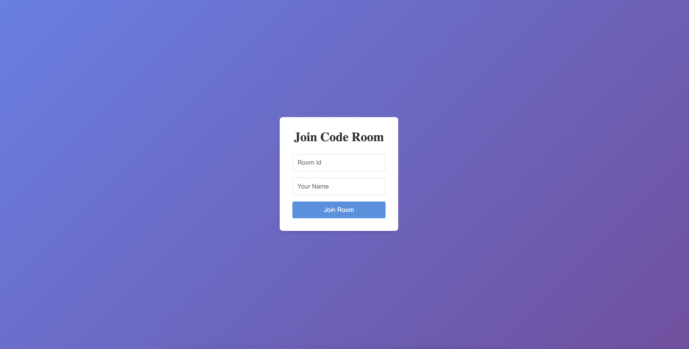
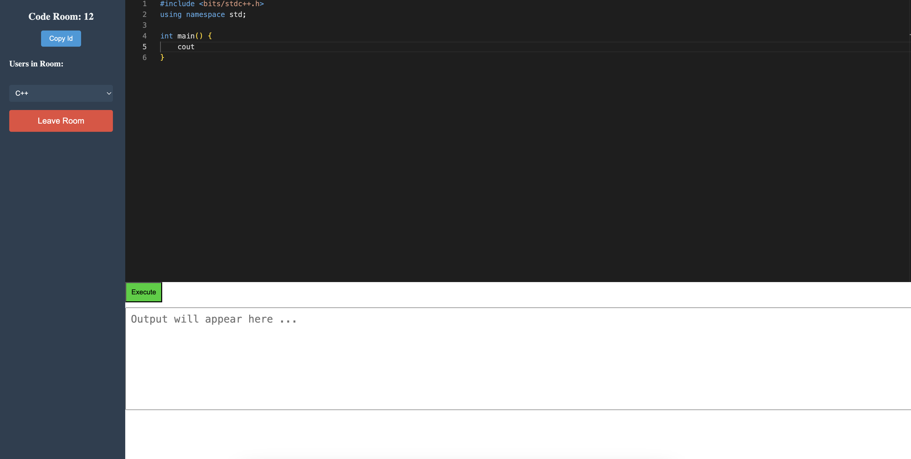

# Code Together

A real-time collaborative coding space with multi-language support. Allowing users to write and execute code in live sessions. The tech stack includes NodeJS, React, HTML and CSS. Integrated SocketIO for multiple-user real-time collaboration and the Piston API to execute the code.


## Demo

**Hosted Link:** https://real-time-code-9ui2.onrender.com/
## Features

- Multiple Users can Join the Same Room
- Real Time Update for all Users
- Run the Code Then and There


## Screenshots



## Tech Stack

**FrontEnd:** React, HTML and CSS  
**BackEnd:** NodeJS, SocketIO  
**API:** Piston

## Run Locally

Clone the Project

```bash
  git clone https://github.com/AkshatPandey2006/real_time_code
```

Open the Project Directory

```bash
  cd real_time_code
```

Install Dependencies

```bash
  npm install
```

Run the Project

```bash
  npm start
```


## Feedback

If you have any feedback, please reach out to us at akshat2006pandey@gmail.com

